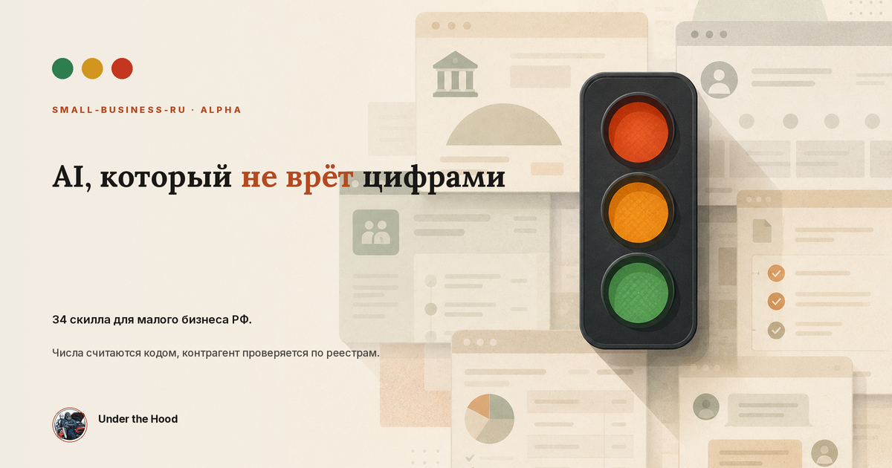
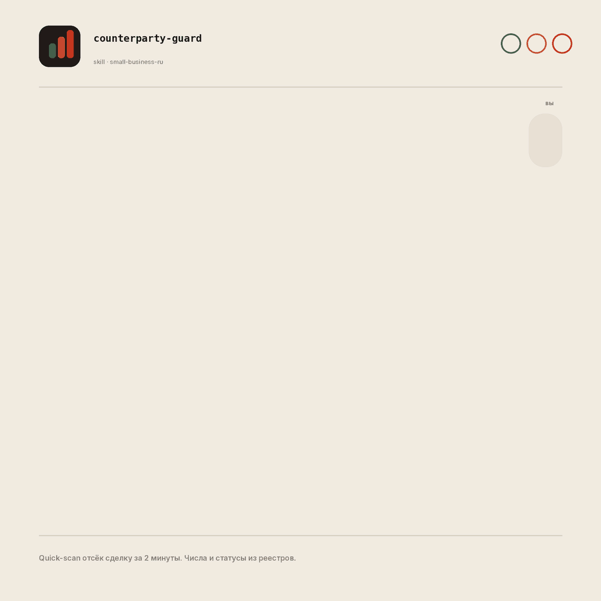
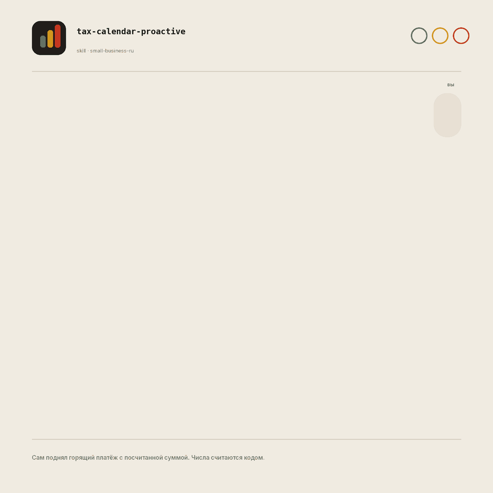

# small-business-ru: an AI co-pilot for small-business owners

> 🇷🇺 [Русская версия](README.md)

> **So you don't lose your mind running the business.** 34 open AI skills for small-business operations in Russia: money, customers, simplified-tax (УСН) filings, contracts under the Russian Civil Code, hiring under the Russian Labor Code. The whole small-business pack from Anthropic (the makers of Claude), localized for Russian reality, plus 3 skills they don't have. For Claude Code, Cursor, Codex, ChatGPT and Gemini. Numbers are computed by **code**, a counterparty is checked against **real government registries** (tax service, bailiffs, arbitration courts), and where there's no data, the skill says "not verified" instead of making something up.

[](LICENSE)
[](https://github.com/anthropics/knowledge-work-plugins/tree/main/small-business)
[](https://github.com/ilyautov/small-business-ru/commits/main)
[](#whats-in-the-umbrella-pack)
[](https://small-business-ru.aifrontier.tech/)
[](https://github.com/ilyautov/small-business-ru/stargazers)
[](https://skills.sh/ilyautov/small-business-ru)

<p align="center">
  <a href="https://small-business-ru.aifrontier.tech/">
    
  </a>
</p>

📖 **Site & docs (in Russian):** [small-business-ru.aifrontier.tech](https://small-business-ru.aifrontier.tech/): how to install, how to use it in plain words, a live demo. [On rolling it out for your business](https://small-business-ru.aifrontier.tech/vnedrenie.html).

## Why this exists

**You're the CFO, the sales department, HR and the lawyer, all at once.** Something always slips: an invoice never went out, a counterparty turned out to be bankrupt right after you shipped, a tax deadline passed, margin quietly drifted away.

Until now you carried all of that alone. small-business-ru is an AI co-pilot for the operational side of running a business: it takes over the routine work around money, customers, taxes, contracts and hiring, and keeps the important things from slipping through the cracks. Say what hurts in plain words, and it walks you through the rest step by step.

Here's the key difference from "just a chatbot." "Add AI to your workflow" usually means an assistant that confidently **lies with numbers**: it invents a tax rate, makes up a supplier's reliability, and you take it as fact because it sounds confident. small-business-ru approaches this from the other side:

- **Numbers are computed by code**, not guessed by a model. Cash-flow forecasts, margin, and simplified-tax (УСН) calculations run through scripts checked against control points.
- **Data from real government registries.** A counterparty is checked against the Unified State Register of Legal Entities (ЕГРЮЛ), the bailiff service (ФССП), the arbitration court database, the bankruptcy register (ЕФРСБ), and the accounting-statements registry (ГИР БО). Every fact ships with a source and a date.
- **"Not verified" instead of a guess.** Where there's no data, the skill says so honestly. The risk traffic light is an estimate, not a verdict; the decision is always yours.

Just say it in plain words: "can I make payroll," "check this counterparty," "close out the month." Claude will pick the right scenario and walk you through it, pausing before anything that touches money or customers.

> ⚠️ **alpha.** Helps with day-to-day work, but doesn't replace an accountant, a lawyer, or an HR specialist. Tax figures are for 2026; check them against current regulations.

## Three Russia-specific skills Anthropic doesn't have

This is the entire Anthropic small-business pack, localized for Russia (all 31 skills, 100% coverage), plus three scenarios built from scratch for Russian reality. They're the proof that this is a genuine localization, not a translation of the English pack.

### `counterparty-guard`: checking a counterparty by tax ID before a deal

Rolls up the state registry (ЕГРЮЛ), bailiff records (ФССП), courts, bankruptcies and financials into a **🟢/🟡/🔴 traffic light** in minutes. It doesn't trust a single aggregator: in a live test, 5 aggregators disagreed on the number of court cases by almost 3x (roughly ~500 / ~1000 / ~1500). A fact is whatever at least 3 sources agree on.

<p align="center">
  
</p>

### `tax-calendar-proactive`: a simplified-tax (УСН) navigator

Proactively shows what's due, when it's due, and **roughly how much to pay**, without being asked. Amounts are computed by script (checked against control points), rates come from the 2026 canon. It warns well ahead of approaching the 20-million-ruble VAT threshold.

<p align="center">
  
</p>

### `cross-source-verify`: a cross-checking engine

Reconciles data from multiple sources with a confidence score and **explicitly surfaces disagreements** instead of silently picking one version. The whole pack is built on this principle.

## What's in the umbrella pack

One marketplace installs three modules — take what you need:

| Module | What it does | Install |
|---|---|---|
| **small-business-ru** | 34 operational skills: money, УСН taxes, receivables, margin, CRM, content, hiring, contracts, counterparty checks | `/plugin install small-business-ru@small-business-ru` |
| **humanizer-ru** | Strips the AI smell out of Russian text: customer replies, posts, and emails sound human | `/plugin install humanizer-ru@small-business-ru` |
| **marketplaces-mcp-ru** | MCP servers for Wildberries + Ozon: sales, stock, prices, finance, reviews straight from the Seller API | `/plugin install marketplaces-mcp-ru@small-business-ru` |

**The modules work together.** An example end-to-end scenario:

> "Pull Wildberries reviews below 4★ from the past week" (marketplaces-mcp-ru) → "group the complaints and draft replies" (the operational skills) → "humanize the replies" (humanizer-ru).

marketplaces-mcp-ru asks for account tokens (`WB_API_TOKEN`, `OZON_CLIENT_ID`, `OZON_API_KEY`); without them, the operational skills still work from CSV/Excel exports.

## What's inside

**34 skills = the entire Anthropic small-business pack (31, 100% coverage) + our 3 built for Russia.** All the roles a business owner ends up carrying alone, in one pack:

- **Money:** cash-flow forecasting, receivables, margin, month-end close
- **УСН taxes:** advance payments, sole-proprietor insurance contributions, contractor payouts
- **Sales / CRM:** lead prioritization, CRM hygiene, campaigns
- **Customers:** complaints, reviews, support
- **Content / marketing:** posts, content strategy, Canva
- **Hiring:** job posting → interview → offer, under Russian labor law
- **Briefings:** Monday / Friday / quarterly
- **Contracts:** review under the Russian Civil Code

A router, `smb-router`, ties it all together and understands plain speech, so you never need to memorize command names. The full skill list lives in [`small-business-ru/README.md`](./small-business-ru/README.md). Rules, the tax/legal layer, and a glossary are in [`small-business-ru/RULES.md`](./small-business-ru/RULES.md).

> **Need deeper financial accounting?** This pack is about fast financial navigation for an owner-operator wearing every hat. For regular management accounting and RAS (Russian accounting standards) bookkeeping, there's a separate pack, **finance-ru**, in the RU Business Packs lineup (P&L / balance sheet / cash-flow statement, per-product margin, receivables, payroll with personal income tax and contributions, inventory/FIFO, marketplaces, AML law 115-FZ, journal entries, ГИР БО accounting-statement forms, audit). Tax figures in both packs come from a single shared canon, so the calculations agree.

## Install

### Claude Code / Cowork (native format)

```text
/plugin marketplace add ilyautov/small-business-ru
/plugin install small-business-ru@small-business-ru
```

Then say **"set me up"** (or its Russian equivalent): the `smb-onboard` skill helps Claude understand your business and wire up the tools. Connecting Russian services (1С, ЮKassa, Bitrix24, Kontur.Diadoc, Yandex 360, Telegram) is optional; without connectors, the skills work from CSV/Excel exports.

### Via skills.sh (any Claude-compatible agent)

```bash
npx skills add ilyautov/small-business-ru
```

The [skills.sh](https://skills.sh) CLI clones the repo and installs the skills into your agent's skill directory (Claude Code, Cursor, Codex, Gemini CLI, and others), via a symlink for Claude Code.

### Other AI stacks (Codex, ChatGPT, Gemini, Cursor)

The logic is portable: one source of truth (`SKILL.md`), with thin wrappers per stack — the body is never forked. Ready-made adapters live in [`adapters/`](./adapters/) (alpha) for the three killer skills:

| Stack | How to connect |
|---|---|
| **Codex (OpenAI CLI)** | copy [`adapters/codex/AGENTS.md`](./adapters/codex/AGENTS.md) into your project root |
| **ChatGPT / Custom GPT** | paste [`adapters/chatgpt/*.md`](./adapters/chatgpt/) into Instructions (one GPT per skill) |
| **Gemini (CLI)** | copy [`adapters/gemini/GEMINI.md`](./adapters/gemini/GEMINI.md) into your project root |
| **Cursor / Windsurf** | copy [`adapters/cursor/*.mdc`](./adapters/cursor/) into `.cursor/rules/` |

The calculation scripts (`fetch_counterparty.py`, `tax_calc.py`) run in Claude Code, Codex, Gemini CLI and Cursor. In plain ChatGPT without Code Interpreter, the math runs off in-prompt formulas or asks you to bring an export.

## Usage

Ask Claude in plain words:

```
check this supplier's tax ID 7700000000 before I prepay
what's due on taxes this quarter
build a 3-month cash-flow forecast
which customers owe me money and how overdue are they
```

Not sure where to start? Say **"set me up"** or **"what can you do for my business."** The router will pick the right skill and ask for whatever's missing.

📋 **All 34 skills with example phrasing** are laid out in [USAGE.md](./USAGE.md): money, taxes, sales, customers, content, hiring, contracts, briefings.

## Before / after

**Checking a counterparty in a single aggregator:**

> Opened one service: about 500 court cases. Looks tolerable, extended payment terms.

**With `counterparty-guard`:**

> Quick-scan for deal-killer signals: "in liquidation" status (from ЕГРЮЛ) plus active bailiff enforcement proceedings. 🔴, stop the collection process, no payment terms. The number of court cases disagreed nearly 3x across three aggregators, so we didn't take the nicest-looking figure — we took the intersection of sources with dates.

The difference isn't "a smarter chatbot" — it's that a fact is agreement across sources, and a deal-killer gets caught before the deal, not after you've shipped.

## FAQ

**How do I check a counterparty by tax ID before a deal?** The `counterparty-guard` skill pulls open data (ЕГРЮЛ, ФССП, the arbitration court database, ЕФРСБ, financials) and produces a risk traffic light with a reason and a recommendation (prepay / extend terms / avoid). It starts with a quick deal-killer scan, then a full dossier on request.

**How do I not miss a УСН tax deadline?** `tax-calendar-proactive` proactively surfaces upcoming deadlines (УСН advance payments, sole-proprietor insurance contributions, filings), computes amounts by script, and warns ahead of time as you approach thresholds.

**Does this work without 1С, using an Excel export?** Yes. Connectors to 1С, your bank, or a CRM are optional; by default the skills run on your CSV/Excel exports.

**Can I use this outside Claude — in Cursor, ChatGPT, Codex, Gemini?** Yes, adapters for the three killer skills live in [`adapters/`](./adapters/). The logic body is one and the same; only the install method changes.

**Is this free?** Yes, open source under Apache-2.0. Take it, fork it, extend it. Rolling it out for your industry and your data is a separate service — see the [site](https://small-business-ru.aifrontier.tech/vnedrenie.html).

**How is this different from aggregators like Kontur.Focus or Checko?** The skill doesn't replace them — it **reconciles several sources** and surfaces disagreements instead of a single number, because aggregators' counts don't match each other. Plus it's built into your AI agent and works alongside the rest of your operations.

**Is it safe — where does my data go?** The skill is a set of instructions for your agent; it runs wherever your Claude or Cursor runs. TLS verification is on by default in the scripts. What gets sent where is your call; for sensitive data you can keep everything local.

## What this isn't

It drafts and assists with the work, but it doesn't replace professional advice. Check tax and legal calculations against current law and a qualified specialist. Any decision that touches money or customers is always yours to make.

This is alpha, open-source software, so **install it, test it against your own data, and experiment.** Found a bug, a questionable figure, or need a skill for your specific case? Open an [issue](https://github.com/ilyautov/small-business-ru/issues) or reach out. Numbers in the examples are deliberately rounded; trust your own runs, not ours.

## Verification, contributing, security

- **Eval.** Calculators are checked against control points: `python3 eval/run_eval.py` (also runs in CI on every PR). Methodology in [`eval/README.md`](./eval/README.md).
- **How to help.** Bug reports, questionable figures, new skills: [CONTRIBUTING.md](./CONTRIBUTING.md).
- **Security.** Threat model, TLS in the network scripts, how to report a vulnerability: [SECURITY.md](./SECURITY.md).

## License & attribution

Apache-2.0 (see [`LICENSE`](./LICENSE)). 31 of the 34 skills are a localized adaptation of Anthropic's open [knowledge-work-plugins / small-business](https://github.com/anthropics/knowledge-work-plugins) pack (Apache-2.0): structure and scenarios by Anthropic, files rewritten for Russia. Original (not derivative): `counterparty-guard`, `tax-calendar-proactive`; `cross-source-verify` is adapted from `enterprise-search`. Details in [`NOTICE`](./NOTICE).

---

**small-business-ru** is an open set of AI skills for small business in Russia: checking a counterparty by tax ID, a 2026 УСН tax calendar, cash-flow forecasting, receivables, margin, hiring under Russian labor law. Free and open source for Claude Code, Cursor, Codex, ChatGPT and Gemini — not a one-click online service. Numbers are computed by code, data comes from real government registries (tax service, bailiffs, arbitration courts).

---

## Who built this

[Ilya Utov](https://github.com/ilyautov), the [AI Frontier](https://aifrontier.tech) lab. I write about how these tools work inside on [Telegram](https://t.me/gorilla_under_hood) and [LinkedIn](https://www.linkedin.com/in/ilyautov).

**Nearby:**

- [**humanizer-ru**](https://github.com/ilyautov/humanizer-ru): strips the AI fingerprint out of Russian text
- [**marketplaces-mcp-ru**](https://github.com/ilyautov/marketplaces-mcp-ru): Wildberries, Ozon, Yandex Market and Avito straight from the agent
- [**consilium-principis**](https://github.com/ilyautov/consilium-principis): a board of thinkers where every quote is checked word for word
- [**hefest**](https://github.com/ilyautov/hefest): chemical safety for an industrial plant, kept inside the plant's own network
- [**cordon**](https://github.com/ilyautov/cordon): a deterministic layer between untrusted content and agent actions

Everything else: [github.com/ilyautov](https://github.com/ilyautov). Useful? Star it, that is how other people find it.
