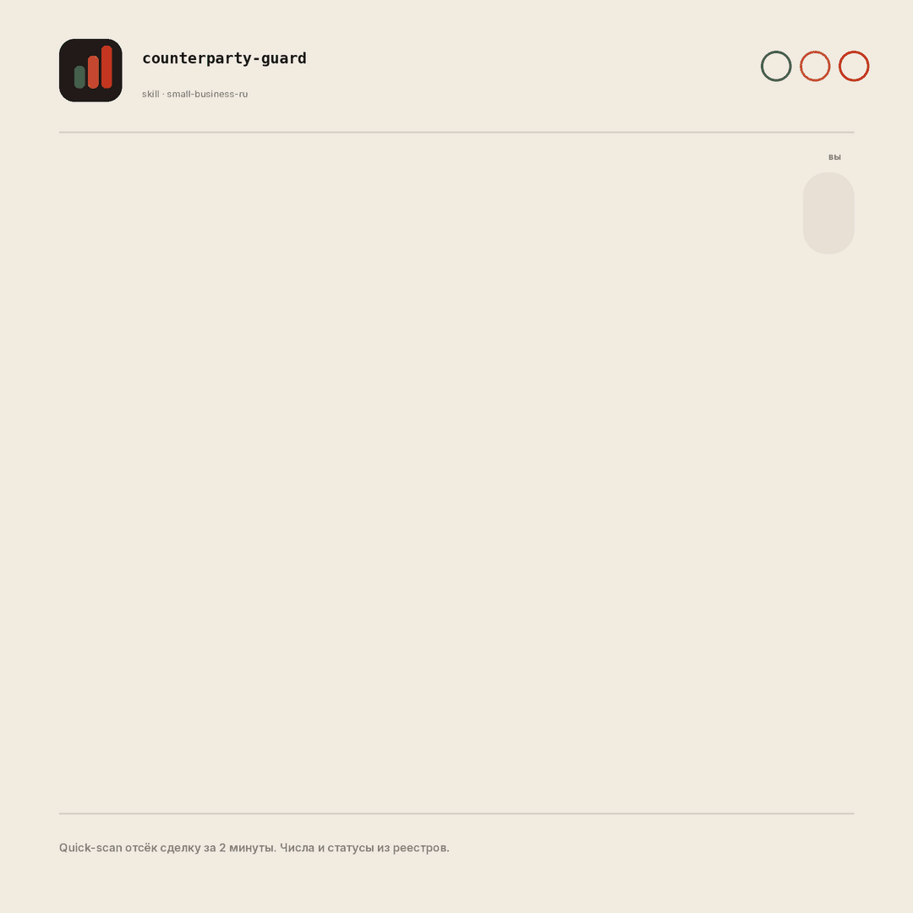
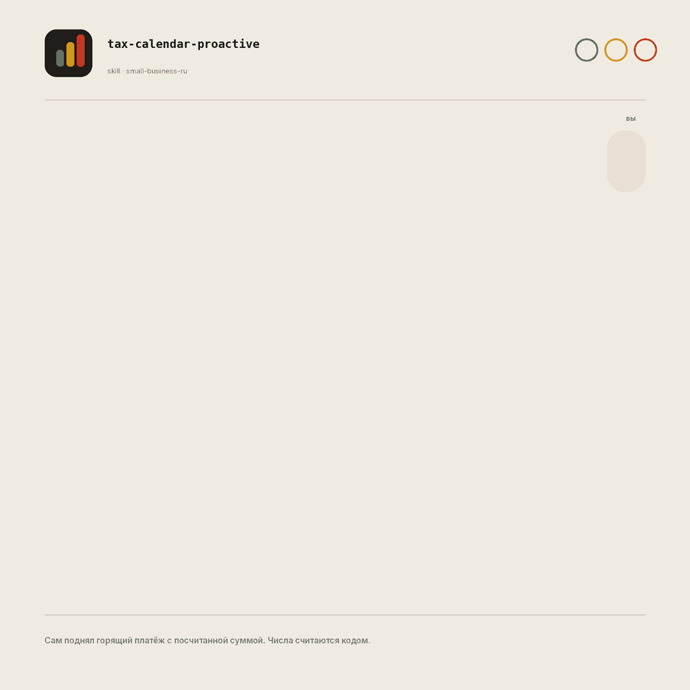

# small-business-ru: открытые AI-скиллы для малого бизнеса в России

> 34 готовых AI-сценария под операционку малого бизнеса РФ для Claude Code, Cursor, Codex, ChatGPT и Gemini: проверка контрагента по ИНН, налоговый календарь УСН, прогноз денег, дебиторка, маржа, найм по ТК РФ. Числа считаются **кодом**, контрагент проверяется по **реальным реестрам** ФНС/ФССП/арбитража, а где данных нет, скилл пишет «не проверено» вместо выдумки.

[](LICENSE)
[](https://github.com/ilyautov/small-business-ru/commits/main)
[](#что-внутри)
[](https://ilyautov.github.io/small-business-ru/)
[](https://skills.sh/ilyautov/small-business-ru)
[](https://github.com/ilyautov/small-business-ru/stargazers)

<p align="center">
  <a href="https://ilyautov.github.io/small-business-ru/">
    
  </a>
</p>

📖 **Сайт и инструкции:** [ilyautov.github.io/small-business-ru](https://ilyautov.github.io/small-business-ru/): как поставить, как пользоваться обычными словами, живое демо. [Про внедрение под ваш бизнес](https://ilyautov.github.io/small-business-ru/vnedrenie.html).

## Зачем это нужно

**Вы и финдиректор, и отдел продаж, и кадровик, и юрист одновременно.** Что-то всегда проваливается: счёт не дослали, контрагент оказался банкротом уже после отгрузки, срок налога прошёл, маржа уехала незаметно.

«Внедрите AI» обычно значит чат, который уверенно **врёт цифрами**: придумает налоговую ставку, выдумает надёжность поставщика, а вы примете это за факт, потому что звучит уверенно. small-business-ru заходит с другой стороны:

- **Числа считаются кодом**, а не прикидываются моделью. Прогноз денежного потока, маржа, налоги УСН считаются скриптами, сверенными на контрольных точках.
- **Данные из реальных реестров.** Контрагент проверяется по ЕГРЮЛ, ФССП, картотеке арбитража, ЕФРСБ, ГИР БО. Каждый факт идёт с источником и датой.
- **«Не проверено» вместо выдумки.** Где данных нет, скилл честно это говорит. Светофор риска это оценка, а не приговор; решение всегда за вами.

Скажите обычными словами: «хватит ли на зарплату», «проверь контрагента», «закрой месяц». Claude подберёт нужный сценарий и проведёт по шагам, останавливаясь перед всем, что трогает деньги или клиентов.

> ⚠️ **alpha.** Помогает с рабочими задачами, но не заменяет бухгалтера, юриста или кадровика. Налоговые цифры на 2026 год; сверяйте с действующими нормами.

## Три скилла, которых нет больше нигде

База это локализация открытого пака Anthropic. Но три сценария мы собрали с нуля под российские реалии, и это лицо продукта.

### `counterparty-guard`: проверка контрагента по ИНН до сделки

Сводит ЕГРЮЛ, ФССП, суды, банкротства, финансы в **светофор 🟢/🟡/🔴** за минуты. Не верит одному агрегатору: в живом тесте 5 агрегаторов разошлись по числу судов почти втрое (примерно ~500 / ~1000 / ~1500). Факт это то, что совпало у ≥3 источников.

<p align="center">
  
</p>

### `tax-calendar-proactive`: налоговый штурман УСН

Сам, без вопроса, показывает что горит, когда срок и **сколько примерно платить**. Суммы считает скриптом (сверен на контрольных точках), ставки берёт из канона 2026. Предупреждает о приближении к НДС-порогу 20 млн заранее.

<p align="center">
  
</p>

### `cross-source-verify`: движок круговой сверки

Сводит данные из нескольких источников с оценкой уверенности и **явным показом расхождений**, не выбирая молча одну версию. На этом принципе стоит весь набор.

## Что внутри

Кроме трёх killer-скиллов, есть ещё **31 сценарий** под операционку владельца-универсала:

- **Деньги:** прогноз денежного потока, дебиторка, маржа, закрытие месяца
- **Налоги УСН:** авансы, страховые взносы ИП, выплаты подрядчикам
- **Продажи / CRM:** приоритет лидов, гигиена CRM, кампании
- **Клиенты:** жалобы, отзывы, поддержка
- **Контент / маркетинг:** посты, контент-стратегия, Canva
- **Найм:** вакансия → интервью → оффер по ТК РФ
- **Брифы:** понедельник / пятница / квартал
- **Договоры:** ревью по ГК РФ

Всё связывает роутер `smb-router`, понимающий обычную речь, так что имена команд запоминать не нужно. Полный список скиллов лежит в [`small-business-ru/README.md`](./small-business-ru/README.md). Правила, налоговый/правовой слой и глоссарий в [`small-business-ru/RULES.md`](./small-business-ru/RULES.md).

## Установка

### Claude Code / Cowork (родной формат)

```text
/plugin marketplace add ilyautov/small-business-ru
/plugin install small-business-ru@small-business-ru
```

Затем скажите **«настрой меня»**: скилл `smb-onboard` поможет Claude понять ваш бизнес и подключить инструменты. Подключение РФ-сервисов (1С, ЮKassa, Битрикс24, Контур.Диадок, Яндекс 360, Telegram) опционально; без коннекторов скиллы работают через выгрузку CSV/Excel.

### Через skills.sh (любой Claude-агент)

```bash
npx skills add ilyautov/small-business-ru
```

CLI [skills.sh](https://skills.sh/ilyautov/small-business-ru) кладёт скиллы в каталог вашего агента и регистрирует их в индексе.

### Другие AI-стеки (Codex, ChatGPT, Gemini, Cursor)

Логика переносима: один источник (`SKILL.md`), а под стеки идут обёртки, тело не форкается. Готовые адаптеры лежат в папке [`adapters/`](./adapters/) (alpha) для трёх killer-скиллов:

| Стек | Как подключить |
|---|---|
| **Codex (OpenAI CLI)** | скопировать [`adapters/codex/AGENTS.md`](./adapters/codex/AGENTS.md) в корень проекта |
| **ChatGPT / Custom GPT** | вставить [`adapters/chatgpt/*.md`](./adapters/chatgpt/) в Instructions (один GPT на один скилл) |
| **Gemini (CLI)** | скопировать [`adapters/gemini/GEMINI.md`](./adapters/gemini/GEMINI.md) в корень проекта |
| **Cursor / Windsurf** | скопировать [`adapters/cursor/*.mdc`](./adapters/cursor/) в `.cursor/rules/` |

Скрипты расчёта (`fetch_counterparty.py`, `tax_calc.py`) работают в Claude Code, Codex, Gemini CLI и Cursor. В чистом ChatGPT без Code Interpreter расчёт идёт по формулам в промпте либо просит принести выгрузку.

## Использование

Попросите Claude по-русски, обычными словами:

```
проверь поставщика по ИНН 7700000000 перед предоплатой
что у меня горит по налогам в этом квартале
построй прогноз денежного потока на 3 месяца
кто из клиентов должен и сколько просрочено
```

Не уверены, с чего начать, скажите **«настрой меня»** или **«что ты умеешь для моего бизнеса»**. Роутер сам подберёт нужный скилл и спросит, чего не хватает.

📋 **Все 34 скилла с примерами фраз** расписаны в [USAGE.md](./USAGE.md): деньги, налоги, продажи, клиенты, контент, найм, договоры, брифы.

## До и после

**Проверка контрагента в одном агрегаторе:**

> Открыл один сервис: около 500 судебных дел. Выглядит терпимо, дал отсрочку.

**Через `counterparty-guard`:**

> Quick-scan по deal-killer-сигналам: статус «в стадии ликвидации» (ЕГРЮЛ) плюс исполнительные производства ФССП. 🔴, сбор остановлен, отсрочку давать нельзя. Число судов у трёх агрегаторов разошлось почти втрое, так что взяли не самую красивую цифру, а пересечение источников с датами.

Разница не в «более умном чате», а в том, что факт это совпадение источников, и deal-killer ловится до сделки, а не после отгрузки.

## Часто ищут

**Как проверить контрагента по ИНН перед сделкой?** Скилл `counterparty-guard` собирает открытые данные (ЕГРЮЛ, ФССП, картотека арбитража, ЕФРСБ, финансы) и выдаёт светофор риска с причиной и рекомендацией (предоплата / отсрочка / избегать). Сначала быстрый quick-scan по deal-killer-сигналам, потом полное досье по запросу.

**Как не пропустить срок налога по УСН?** `tax-calendar-proactive` сам показывает ближайшие сроки (авансы УСН, страховые взносы ИП, отчётность), считает суммы скриптом и заранее предупреждает о приближении к порогам.

**Работает ли это без 1С, с выгрузкой Excel?** Да. Коннекторы к 1С, банку, CRM опциональны; базово скиллы работают на ваших выгрузках CSV/Excel.

**Можно ли использовать не в Claude, в Cursor, ChatGPT, Codex, Gemini?** Да, для трёх killer-скиллов есть адаптеры в папке [`adapters/`](./adapters/). Тело логики одно, меняется только способ установки.

**Это бесплатно?** Да, открытый код под Apache-2.0. Берите, форкайте, дорабатывайте. Внедрение под вашу отрасль и данные это отдельная услуга, см. [сайт](https://ilyautov.github.io/small-business-ru/vnedrenie.html).

**Чем отличается от агрегаторов вроде Контур.Фокуса или Checko?** Скилл их не заменяет, а **сводит несколько источников** и показывает расхождения вместо одной цифры, потому что счётчики у агрегаторов не совпадают. Плюс он встроен в вашего AI-агента и работает в связке с остальной операционкой.

**Безопасно ли, куда уходят мои данные?** Скилл это инструкция для вашего агента; он работает там, где работает ваш Claude или Cursor. TLS-проверка в скриптах включена по умолчанию. Что и куда отправлять, решаете вы; для чувствительных данных можно держать всё локально.

## Чем это не является

Готовит черновики и помогает в работе, но не заменяет профессиональную консультацию. Налоговые и правовые расчёты сверяйте с актуальным законодательством и профильным специалистом. Решение, которое трогает деньги или клиентов, всегда за вами.

Это alpha и открытый код, поэтому **ставьте, проверяйте на своих данных и экспериментируйте.** Нашли косяк, спорную цифру или нужен скилл под вашу задачу, заводите [issue](https://github.com/ilyautov/small-business-ru/issues) или пишите. Цифры в примерах намеренно округлены; доверяйте не нашим, а своим прогонам.

## Проверка, вклад, безопасность

- **Eval.** Калькуляторы сверены на контрольных точках: `python3 eval/run_eval.py` (и в CI на каждый PR). Методика в [`eval/README.md`](./eval/README.md).
- **Как помочь.** Багрепорты, цифры под сомнением, новые скиллы: [CONTRIBUTING.md](./CONTRIBUTING.md).
- **Безопасность.** Модель угроз, TLS в сетевых скриптах, как сообщить об уязвимости: [SECURITY.md](./SECURITY.md).

## Лицензия и атрибуция

Apache-2.0 (см. [`LICENSE`](./LICENSE)). 31 из 34 скиллов это локализованная адаптация открытого пака Anthropic [knowledge-work-plugins / small-business](https://github.com/anthropics/knowledge-work-plugins) (Apache-2.0): структура и сценарии от Anthropic, файлы переписаны под РФ. Оригинальные (не производные): `counterparty-guard`, `tax-calendar-proactive`; `cross-source-verify` адаптирован из `enterprise-search`. Подробности в [`NOTICE`](./NOTICE).

---

**small-business-ru** это открытый набор AI-скиллов для малого бизнеса в России: проверка контрагента по ИНН, налоговый календарь УСН на 2026, прогноз денежного потока, дебиторка, маржа, найм по ТК РФ. Бесплатный open-source для Claude Code, Cursor, Codex, ChatGPT и Gemini, а не онлайн-сервис «в один клик». Числа считаются кодом, данные берутся из реальных реестров ФНС/ФССП/арбитража.
